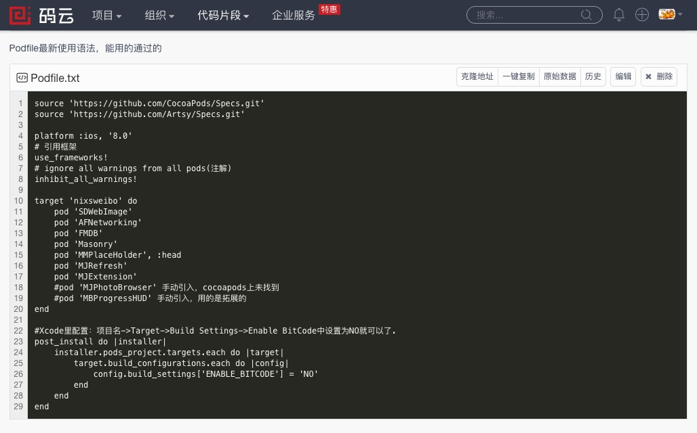

>[(1)nil / Nil / NULL / NSNull](http://nshipster.cn/nil/)
>* Mattt Thompson撰写、 Zihan Xu翻译、 发布于2013年1月7日

>

>[(3)此人-Android,iOS博客均不错|(2)仿新浪微博IOS客户端（v5.2.8）——下拉菜单栏的实现](http://blog.csdn.net/android_ls/article/details/45877983)
>

---
>*[podfile代码段](http://git.oschina.net/KAERBluetooth/codes/9hd37w15lcijxrzvm2fgu)

>

---
